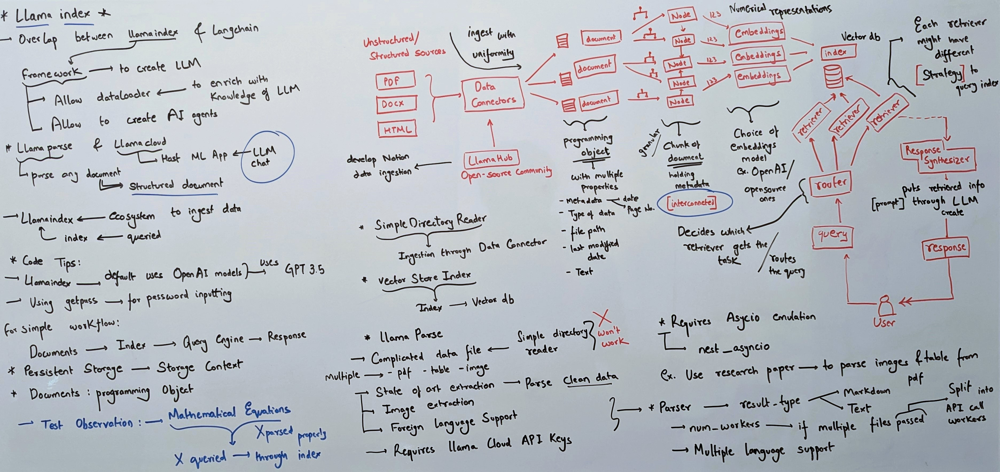

# Introduction to LlamaIndex 🦙
<a href="https://colab.research.google.com/drive/1E6Gi6oL3opx6529AXoI9oKrxPVT4xrcc#scrollTo=0XRlrZ4aHqJD/"></a>
<a href="https://gist.github.com/shiv-rna/a8e5883b3adc53ef2af8b7b985b9a951"></a>
## 📝 Overview

This repository contains my learning experience and practical implementation of the **LlamaIndex** framework in Python. This project explores the core components of LlamaIndex, its unique approach to context augmentation, and the process of creating LLM (Large Language Model) applications. 

The repository covers everything from basic definitions to implementing a simple pipeline, making it a valuable resource for anyone looking to get started with LlamaIndex.

## 🧑‍🏫 Whiteboard


## 🗝️Key Concepts

### What is LlamaIndex?

LlamaIndex is a framework that enables developers to create LLM applications such as chatbots, AI assistants, and translation machines. It offers a robust ecosystem with features like data loaders to enrich your language model with custom data, creating sophisticated AI-driven applications.

### Comparison with LangChain

While LlamaIndex shares similarities with LangChain in enabling LLM applications, it distinguishes itself by providing a more structured approach to context augmentation and data ingestion.

### Core Components of LlamaIndex

- **Data Connectors**: Ingest structured and unstructured data from various formats (PDF, HTML, CSV, etc.) into a uniform format for LLM applications.
- **Documents**: Programming objects that contain structured data from your files, including text and metadata.
- **Nodes**: Granular chunks of data that retain metadata and are interconnected to create a network of knowledge.
- **Embeddings**: Numerical representations of nodes, capturing the meaning of the data for use in vector databases.
- **Index**: A vector database containing all numerical representations of your data, enabling efficient querying.
- **Router & Retrievers**: Components that handle queries by routing them to the appropriate retriever, which then fetches relevant information from the index.
- **Response Synthesizer**: Combines retrieved documents with a prompt to generate responses enriched with custom data.

### Installation and Setup

To get started with LlamaIndex, follow these steps:

1. Install LlamaIndex:
     ```bash
     pip install -Uq llama-index
     ```
2. Setup OpenAI API key:
    ```bash
    import getpass
    import os
    os.environ['OPENAI_API_KEY'] = getpass.getpass("OpenAI API key: ")
    ```
3. Create a `data` folder and add your documents (e.g. constitution.pdf, attention.pdf).
4. Implement the pipeline using the famous "five-liner" in LlamaIndex:
    ```bash
    from llama_index import VectorStoreIndex, SimpleDirectoryReader
    
    documents = SimpleDirectoryReader('data').load_data()
    index = VectorStoreIndex.from_documents(documents)
    query_engine = index.as_query_engine()
    response = query_engine.query("What is the first article of the Constitution?")
    print(response)
    ```
### Persistent Index
To avoid re-ingesting data every time you run your pipeline, consider making the data persistent by saving the index to disk.

### Supported File Formats
LlamaIndex supports a wide range of file formats, including but not limited to:
CSV, DOCX, HTML, JSON, PDF, PowerPoint, Word, JPEG
For more detailed information, refer to the LlamaIndex documentation.

## 🦙LlamaParse
A tool designed to extract and preprocess text from various document formats to make them ready for LlamaIndex ingestion. This utility streamlines the process of converting complex document structures (especially in case SimpleDirectoryReader wouldn't work for example pdf with images) into plain clean text, which is crucial for effective indexing and querying.

## 👨‍💻Conclusion
This guide introduces you to LlamaIndex, covering installation, setup, and basic usage. Explore the code, adapt it to your needs, and contribute to enhancing the project. For further details, consult the LlamaIndex documentation.
   

